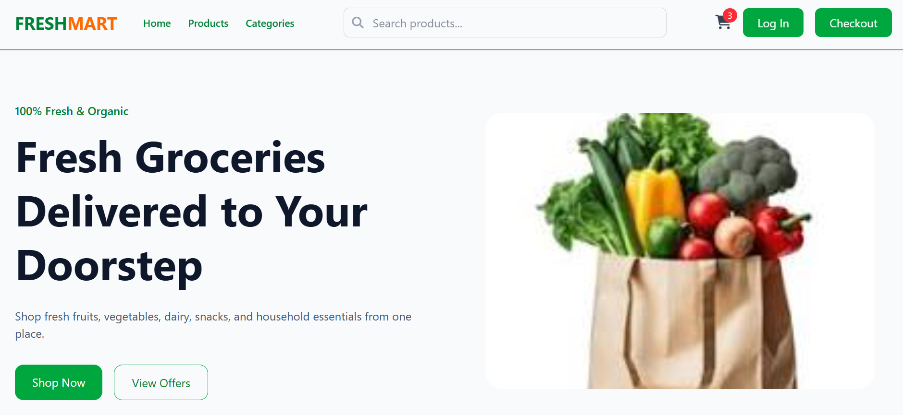
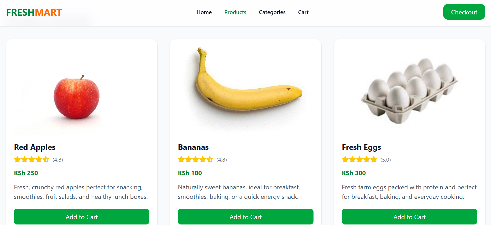
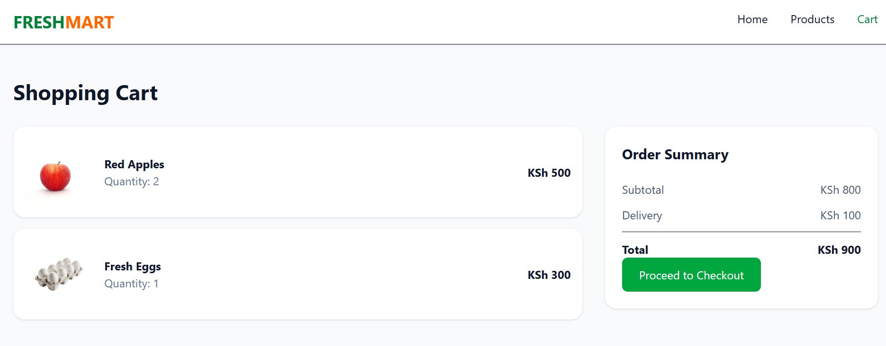
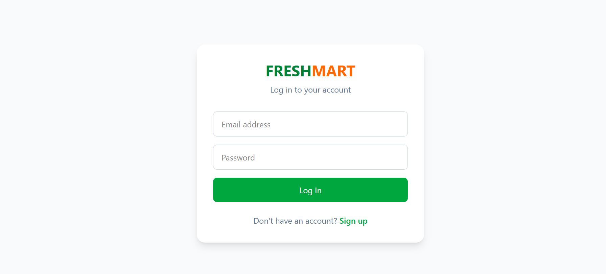
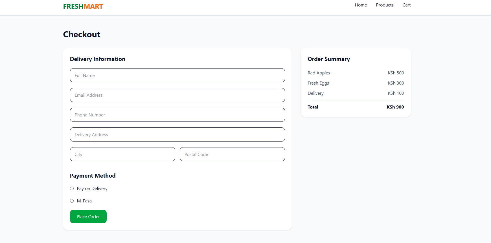

# Freshmart

## Project overview

Freshmart is a grocery shopping website that showcase grocery product, categories, promotions, and an easy-to-navigate shopping experience.

The project focuses on:

- Responsive web design
- Modern UI/UX principles
- Clean and semantic HTML structure
- Tailwind CSS utility-first styling

## Features

### Home Page

- Responsive navigation bar
- Hero section with call-to-action buttons
- Product categories section
- Featured products section
- Promotional offers banner
- Customer testimonials
- Footer with social links

### Products Page

- Product listing grid
- Product cards
- Product pricing
- Add-to-cart buttons (UI only)

### Category Page

- Browse products by category
- Category cards
- Responsive grid layout

### Product Details Page

- Product image gallery
- Product description
- Pricing information
- Add-to-cart button
- Related products section

### Cart Page

- Shopping cart layout
- Product quantity display
- Order summary section

### Checkout Page

- Customer information form
- Shipping details
- Order summary
- Payment section (UI only)


## Project Structure

```bash
Freshmart/
│
├── index.html
├── products.html
├── category.html
├── product-details.html
├── cart.html
├── checkout.html
│
├── assets/
│   ├── images/
│
├── README.md
└── License
```

## Technologies used

### Frontend

- HTML5
- Tailwind CSS

### Design Tools

- Figma (Wireframes & UI Design)
- Unsplash (Placeholder Images)

### Version Control

- Git
- GitHub

### Deployment

- GitHub Pages
- Vercel

## Installation

### 1. Clone the Repository

```bash
git clone https://github.com/yourusername/freshmart.git
```

### 2. Navigate to the Project Folder

```bash
cd freshmart
```

### 3. Open the Project

Simply open:

```text
index.html
```

in your browser.

Alternatively, use VS Code Live Server:

```bash
Right Click → Open with Live Server
```

## Deployment
 
### GitHub Pages

1. Push project to GitHub
2. Open Repository Settings
3. Navigate to:

```text
Settings → Pages
```

4. Select:

```text
Deploy from branch → main
```

5. Save changes

GitHub will generate a live URL for your project.


### Vercel

1. Login to Vercel
2. Import GitHub Repository
3. Select project
4. Click Deploy

Vercel will automatically generate a production URL.

## Images

### Home pages



### Product detail page



### Cart



### Login page



### Checkout page



## Future improvements

### Phase 2

- JavaScript functionality
- Shopping cart interactions
- Product filtering
- Search functionality
- Mobile menu toggle

### Phase 3

- Backend integration
- User authentication
- Payment gateway integration
- Order management system
- Customer accounts

### Phase 4

- Wishlist functionality
- Product reviews
- Dark mode
- Real-time inventory management
- Admin dashboard

## How to contribute

Contributions are welcome and appreciated!

If you'd like to contribute to this project, please follow these steps:

### 1. Fork the Repository

Click the **Fork** button at the top-right corner of this repository.

### 2. Clone Your Fork

```bash
git clone https://github.com/your-username/freshmart.git
```

### 3. Create a New Branch

Create a branch for your feature or bug fix:

```bash
git checkout -b feature/your-feature-name
```

Examples:

```bash
git checkout -b feature/product-search
git checkout -b feature/mobile-navbar
git checkout -b fix/cart-layout
```

### 4. Make Your Changes

Implement your feature or bug fix while following the project's coding standards and structure.

### 5. Commit Your Changes

```bash
git add .
git commit -m "Add product search section"
```

### 6. Push Your Changes

```bash
git push origin feature/your-feature-name
```

### 7. Open a Pull Request

Create a Pull Request (PR) describing:

- What you changed
- Why you made the change
- Screenshots (if applicable)
- Any known issues

### Contribution Guidelines

- Use semantic HTML5.
- Follow Tailwind CSS best practices.
- Keep code clean and properly indented.
- Ensure the website remains responsive.
- Test changes before submitting a Pull Request.
- Update documentation when necessary.

### Reporting Issues

If you find a bug or have a feature request:

1. Open an Issue.
2. Provide a clear description.
3. Include steps to reproduce the issue (if applicable).
4. Add screenshots where helpful.

Thank you for helping improve FreshMart!

## Deployment links

* Github pages: https://ayub2022.github.io/freshmart/

* Vercel: https://freshmart-mu.vercel.app/

## License

This project is licensed under the MIT License.

## Author

**Ayub Kinyua**

* GitHub: [https://github.com/ayub2022](https://github.com/ayub2022)
* Email: ayubmaina2017@gmail.com
